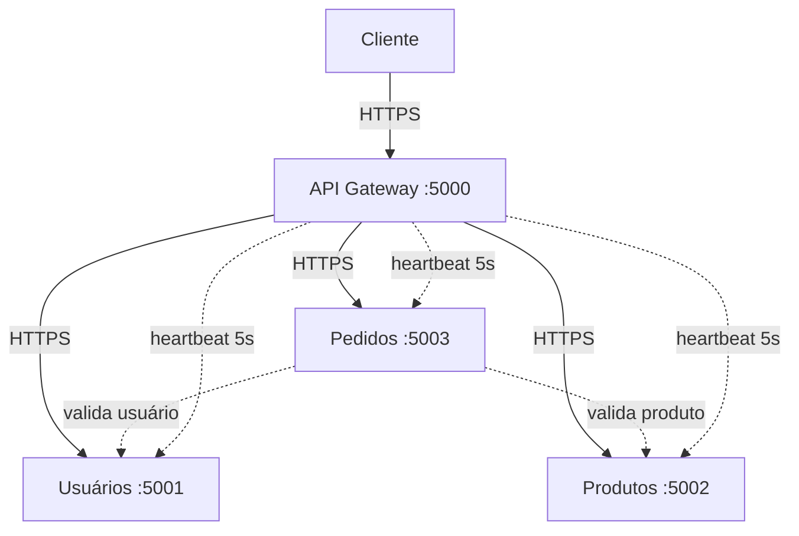
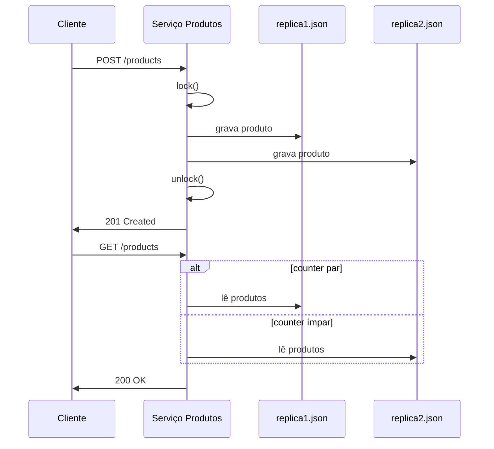
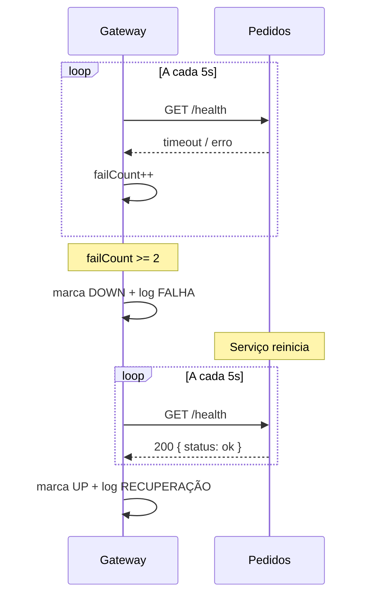
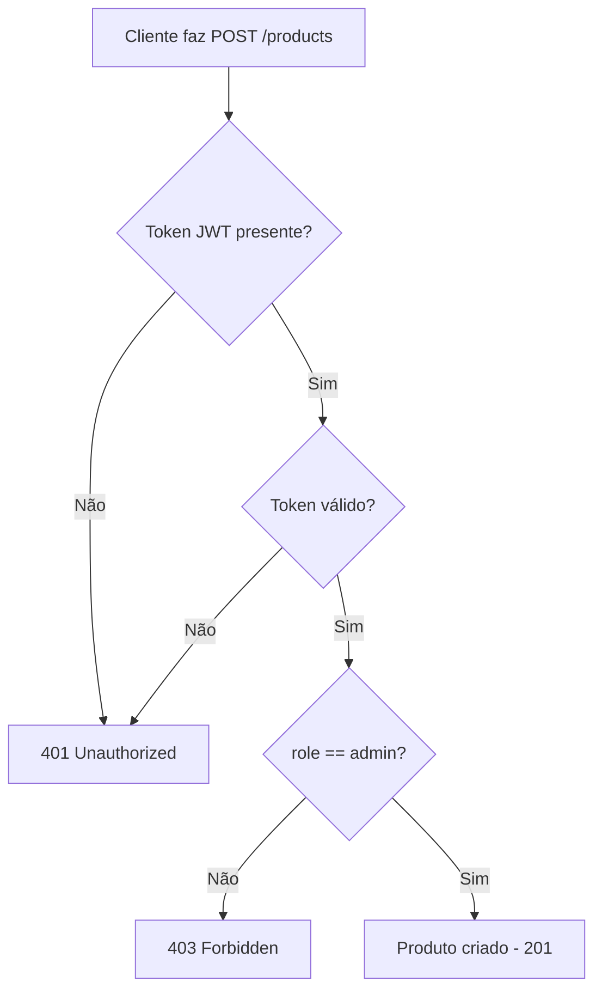

# Relatório — Mini E-commerce Distribuído

## 1. Como a comunicação entre os microsserviços foi implementada?

A comunicação entre os microsserviços é feita via **REST sobre HTTPS**. Existem dois padrões de comunicação:

**Gateway → Serviços (reverse proxy):**
O API Gateway recebe todas as requisições do cliente e as encaminha para o microsserviço correto baseado no prefixo da rota (`/users/**`, `/products/**`, `/orders/**`). O gateway repassa o body, os headers (incluindo `Authorization` com JWT) e o método HTTP original. A resposta do serviço é devolvida ao cliente de forma transparente.

**Serviço → Serviço (chamada direta):**
O serviço de Pedidos precisa validar a existência do usuário e dos produtos antes de criar um pedido. Para isso, ele faz chamadas HTTP diretas aos serviços de Usuários e Produtos usando `HttpClient`.

Toda comunicação interna usa HTTPS com certificado autoassinado, garantindo criptografia em trânsito.

---

## 2. Qual estratégia de consistência foi adotada na replicação? Forte ou eventual? Por quê?

Foi adotada **consistência forte**. O serviço de Produtos mantém duas réplicas do seu armazenamento (`replica1.json` e `replica2.json`) no mesmo processo, gerenciadas pela classe `ReplicatedStore`.

**Como funciona:**
- **Escrita:** toda operação de escrita (criação de produto) adquire um lock exclusivo, grava o dado em `replica1.json` e em seguida em `replica2.json`. A resposta ao cliente só é enviada **após ambas as gravações serem concluídas**.
- **Leitura:** as leituras alternam entre as duas réplicas usando round-robin via `Interlocked.Increment`. Como ambas as réplicas sempre contêm os mesmos dados (garantido pela escrita síncrona), qualquer réplica retorna dados atualizados.

**Justificativa:** como ambas as réplicas residem no mesmo processo e acessam o sistema de arquivos local, a latência adicional de gravar em dois arquivos é desprezível. Nesse cenário, a consistência forte é simples de implementar e elimina riscos de leitura de dados desatualizados, o que seria inaceitável para um catálogo de produtos (ex: exibir preço incorreto).

---

## 3. O que acontece com o sistema se o Serviço de Pedidos cair?

O restante do sistema **continua funcionando normalmente**. Especificamente:

- O **serviço de Usuários** continua respondendo (login, registro, consulta de perfil).
- O **serviço de Produtos** continua respondendo (listagem, criação por admin).
- O **API Gateway** detecta a falha via heartbeat (a cada 5 segundos, com 2 tentativas) e:
  1. Registra a falha em log: `[timestamp] FALHA: Serviço orders indisponível`
  2. Marca o serviço como indisponível internamente
  3. Retorna **503 Service Unavailable** para qualquer requisição direcionada a `/orders/**`
- O **dashboard** exibe o serviço de Pedidos com status offline (🔴) em tempo real.

Quando o serviço de Pedidos é reiniciado, o gateway detecta a recuperação e registra: `[timestamp] RECUPERAÇÃO: Serviço orders disponível`. O dashboard volta a exibir status online (🟢).

---

## 4. Como o JWT garante que um usuário comum não consiga criar produtos?

O controle de acesso é implementado em três camadas:

1. **Geração do token:** ao fazer login, o serviço de Usuários gera um token JWT contendo a claim `role` (que pode ser `"user"` ou `"admin"`). O token é assinado com HMAC-SHA256 usando uma chave secreta compartilhada entre todos os serviços.

2. **Validação do token:** o endpoint `POST /products` exige autenticação JWT (`.RequireAuthorization()`). Antes de processar a requisição, o middleware de autenticação valida a assinatura, o issuer, a audience e a expiração do token.

3. **Verificação da role:** dentro do handler do endpoint, o código extrai a claim `role` do token e verifica se é `"admin"`. Se o valor for diferente, retorna **403 Forbidden** com a mensagem `"Apenas administradores podem criar produtos"`.

Como o token é assinado com chave secreta, um usuário não consegue forjar um token com role `"admin"`. A chave nunca é exposta ao cliente.

---

## 5. Quais limitações a implementação possui em relação a um sistema real de produção?

| Limitação | Impacto em produção |
|---|---|
| **Réplicas no mesmo processo** | Se o processo cair, ambas as réplicas ficam indisponíveis. Em produção, réplicas seriam distribuídas em nós separados. |
| **Armazenamento em JSON** | Sem suporte a queries complexas, índices, transações ACID ou acesso concorrente eficiente. Um banco relacional (PostgreSQL) ou NoSQL (MongoDB) seria necessário. |
| **Certificado autoassinado** | Não seria aceito por navegadores ou clientes em produção. Seria necessário um certificado emitido por uma CA confiável (ex: Let's Encrypt). |
| **Sem rate limiting** | Sem proteção contra ataques de força bruta ou DDoS. Seria necessário implementar rate limiting no gateway. |
| **Sem circuit breaker** | Se um serviço ficar lento (mas não cair), as requisições acumulam. Um circuit breaker (ex: Polly) evitaria cascata de falhas. |
| **Comunicação síncrona** | Sem filas de mensagens (RabbitMQ, Kafka). Em produção, a criação de pedidos seria assíncrona para desacoplamento. |
| **Sem escalabilidade horizontal** | Não há orquestração (Kubernetes) para auto-scaling de instâncias dos serviços. |
| **Secret JWT em variável de ambiente** | Em produção, usaria um cofre de segredos (AWS Secrets Manager, Azure Key Vault). |
| **Sem observabilidade** | Falta de métricas (Prometheus), tracing distribuído (Jaeger) e logs centralizados (ELK Stack). |
